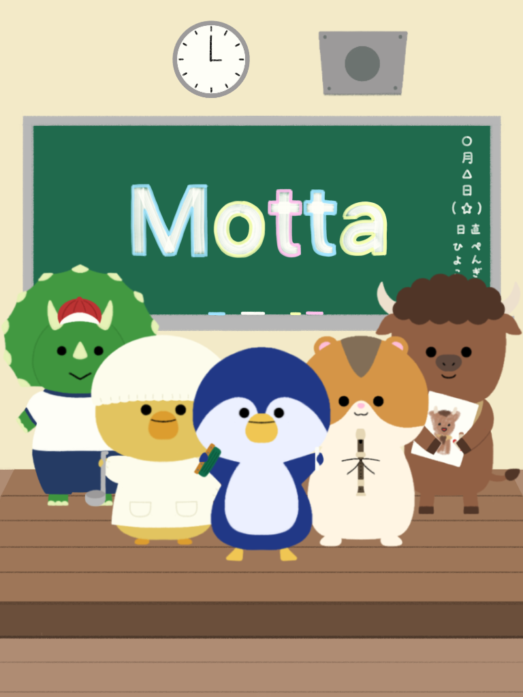

# Motta_student

子供(小学校低学年)の持ち物確認が楽しくなる様にするためのアプリ。<br>音声読み上げ、音声認識、カレンダなどが含まれている。



## Getting Started

### 前提：①Flutter の環境を用意する。②vscode を用意する。

flutter に関しては下記参照

> This project is a starting point for a Flutter application.
>
> A few resources to get you started if this is your first Flutter project:
>
> - [Lab: Write your first Flutter app](https://docs.flutter.dev/get-started/codelab)
> - [Cookbook: Useful Flutter samples](https://docs.flutter.dev/cookbook)
>
> For help getting started with Flutter development, view the
> [online documentation](https://docs.flutter.dev/), which offers tutorials,
> samples, guidance on mobile development, and a full API reference.

### 1.git clone

任意のフォルダでこのリポジトリを clone する。

```shell
git clone "https_url/ssh_url"
```

### 2.プロジェクトフォルダに移動

```shell
cd Motta_student
```

### 3.flutter プロジェクト setup

```shell
flutter clean
flutter pub get
```

### 4.Chrome で実行する

```shell
flutter run
```

選択プロンプトで Chrome(web)選択

### 5.ゲームを楽しむ

ゲームの途中で、Chrome からマイクの使用許可が問われるので、許可すると、音声認識できる様になる。
ゲーム上のキャラクターが「もった？」と問いかけたら、持ち物があるかを確認して、「もった！」と返事する。音声が正しく認識できたら、次の問いに変わる。

##
